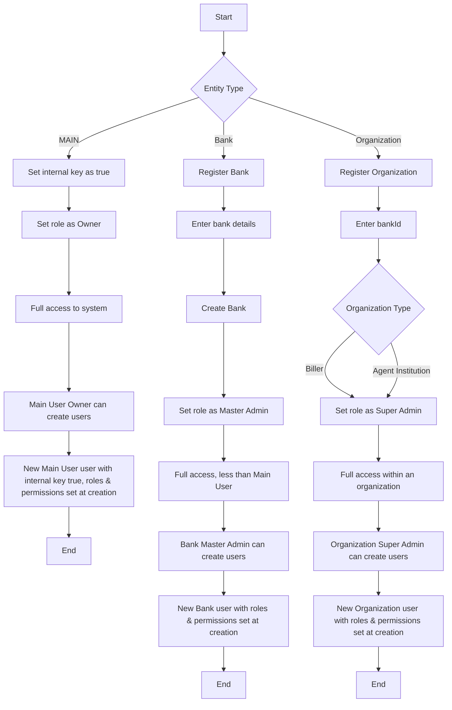
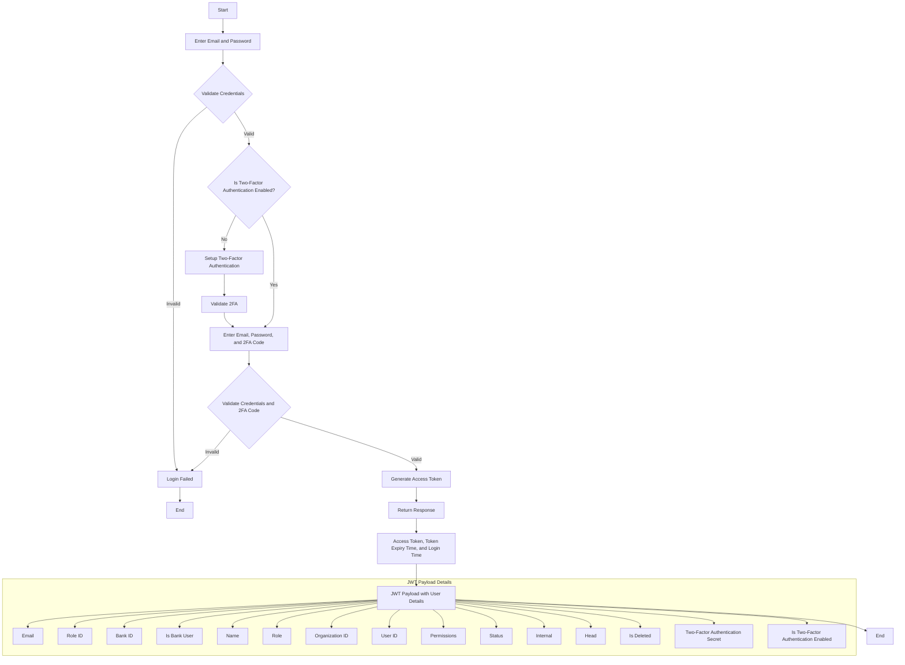

# Dashboard Authentication

##### A centralized authentication module for the TSP Dashboard

### Entities this authentication server is for

- MAIN with the `internal` key set to `true` for all Main User users and the default role set to `Owner` for the first registered user.
- Bank(s) with the default role set to `Master Admin` for the first registered user.
- Organization(s) either as `Biller` or `Agent Institution` with the default role set to `Super Admin`.

[Register Flow Diagram]()



[Login Flow Diagram]()



### Base URL: `http://localhost:7005/v1`

### Postman Collection URL: <https://Main User-one-tsp-team.postman.co/workspace/Team-Workspace~65cb7d5e-637f-4470-8b06-c91837401dc5/collection/36679509-f1cab2bb-e3b0-4597-a0f5-8dc1c01b8275?action=share&creator=36679509>

# Auth

#### Register Bank(s)

```js
[POST] /auth/banks/register
```

**Payload:**

| Name          | Type     | Description                                      |
| ------------- | -------- | -------------------------------------------------|
| bankName*     | string   | Name of the Bank                                     |
| branch*       | string   | Branch name of the bank                         |
| name*         | string   | Name of the default user                         |
| email*        | string   | Email for the authorized user                       |
| password*     | string   | Password to secure account                       |
| address*      | object   | Address of the bank is loacted                    |

[For complete reference click here](http://localhost:7005/api#/Banks%20Controllers/BanksController_register)

**Response:**

```json
{
    "bankId": "PUN@XYRM5",
    "bankName": "Punjab National Bank",
    "branch": "Noida",
    "status": "Active",
    "isDeleted": false,
    "_id": "6684ddbcc123ee9a2c3e99e3",
    "createdAt": "2024-07-03T05:12:28.553Z",
    "updatedAt": "2024-07-03T05:12:28.553Z",
    "email": "admin@pnb.in",
    "name": "Admin",
    "roleId": "6683cf5ea26974e6b5e157f5",
    "head": null,
    "permissionId": true,
    "internal": false,
    "isBankUser": true,
    "userId": "6684ddbcc123ee9a2c3e99e6"
}
```

#### Login

```js
[POST] /auth/banks/login
```

**Payload:**

| Name      | Type   | Description                    |
| --------- | ------ | -------------------------------|
| email*    | string | Registered email               |
| password* | string | Correct password               |

[For complete reference click here](http://localhost:7005/api#/Banks%20Controllers/BanksController_login)

**Response:**

```json
{
    "token": "U2FsdGVkX18blzMzu1HTqd6lwnu1WA+829eqOhJkBgM+n4pkuxz0SkAmXLsIqPc7EliZ5P2z0AoYro0US9ak4qlbEqbyejIBOtRkYoHGGT/KOmTx+y9Pejl0zD20fN3T/Vmozh/us64z5WiNHGrKuNi7bhnBQu98eUdCFmtCGNeWtIJVLsD2FbfFjiVQtksYXklDWM6PN7Xxf/YpsNxeXRq+rKjTpLupTfBry0k30DCBPE7n1aL2ZALAjy8AO5KjcbOglsSrrhpyqnKtNwD4XlrglY5HTTVaqSZi503TkEkKTuAPKCDkG5IZVdmcMZVxOQ+PBPVZPr53l9sSc4O6dGMnOcderrQROkeKcYEcG6/KqQl1w8k3/7A6pFXD4LJ6xMOMBWf7ggmDpIPeRI8TjcB/Djk+QZb1yFLTDjPKUTFI9TnADdv/hFwfRLc+dFLNj83mKG/vYsaDSPUI6w6wGUt6BuN2aO5jXtSCk7v8QW8KSiUltGCffBpRh3jDb2bt6zDViVxKKtYhzayFbgZwpe9RDe69lJ5SIcH+0A28WP/Qpvakb8ybHmZD1E/f1dWWFjAw++3r7GYP1ZEJxVTibqIdDYxPGjKW/3vSXglIaorK0Co+vaJvlYLpKCIUmys72nZFEm8ZfD+9Q1Cpf/9Qu74VgjTazrnk2yWnTFnxaaR6bmnqWRjdk/1+RPaRkjOHoYDN/EcRk/TK9gZ+6qHwPY84b+d+LcwzDfPJU503IIdZ7NVzzl1DzgGv6SXjrN+sxwdcXTuF0RGVmwBrhhcl3SMkX+xV43ATzuFQ3FA/CEc=",
    "expiredIn": "1d",
    "createdAt": "2024-07-12T11:31:12.341Z"
}
```

#### Register Organization(s)

```js
[POST] /auth/register
```

**Payload:**

| Name          | Type     |
| ------------- | -------- |
| bankId*       | string   |
| billerId     | string    |
| companyName*  | string   |
| phone*        | string   |
| gst*          | string   |
| type*         | object   |
| scopes*       | string[] |
| email*        | object   |
| name*         | object   |
| password*     | object   |

[For complete reference click here](http://localhost:7005/api#/Biller%20or%20Agent%20Institution%20Auth%20Controller/AuthController_register)

**Response:**

```json
{
    "orgId": "BIL64IW",
    "companyName": "Biller Company",
    "phone": 9898989812,
    "gst": "QW7538R5PC82EDL",
    "type": "Biller",
    "status": "Active",
    "clientKey": "be8238b8-2e37-4dcd-9250-472a6d0cf24f",
    "clientSecret": "$2b$10$eNmq88pROHNYa5aTeO5BFeD8KEcnfik4c0r7E3fqhEa7kan4Y2uNq",
    "scopes": "read_bills read_packs",
    "email": "biller1@bses.in",
    "roleId": "666fd1ef020d78cfd79c4e47",
    "head": true,
    "permissionId": "6670094abeb4b32c2b345dd5",
    "internal": false,
    "createdAt": "2024-06-17T10:00:42.803Z",
    "updatedAt": "2024-06-17T10:00:42.803Z",
    "userId": "6670094abeb4b32c2b345dd7"
}
```


#### Login

```js
[POST] /auth/login
```

**Payload:**

| Name      | Type   | Description                    |
| --------- | ------ | -------------------------------|
| email*    | string | Registered email               |
| password* | string | Correct password               |

[For complete reference click here](http://localhost:7005/api#/Biller%20or%20Agent%20Institution%20Auth%20Controller/AuthController_login)

**Response:**

```json
{
    "token": "U2FsdGVkX18blzMzu1HTqd6lwnu1WA+829eqOhJkBgM+n4pkuxz0SkAmXLsIqPc7EliZ5P2z0AoYro0US9ak4qlbEqbyejIBOtRkYoHGGT/KOmTx+y9Pejl0zD20fN3T/Vmozh/us64z5WiNHGrKuNi7bhnBQu98eUdCFmtCGNeWtIJVLsD2FbfFjiVQtksYXklDWM6PN7Xxf/YpsNxeXRq+rKjTpLupTfBry0k30DCBPE7n1aL2ZALAjy8AO5KjcbOglsSrrhpyqnKtNwD4XlrglY5HTTVaqSZi503TkEkKTuAPKCDkG5IZVdmcMZVxOQ+PBPVZPr53l9sSc4O6dGMnOcderrQROkeKcYEcG6/KqQl1w8k3/7A6pFXD4LJ6xMOMBWf7ggmDpIPeRI8TjcB/Djk+QZb1yFLTDjPKUTFI9TnADdv/hFwfRLc+dFLNj83mKG/vYsaDSPUI6w6wGUt6BuN2aO5jXtSCk7v8QW8KSiUltGCffBpRh3jDb2bt6zDViVxKKtYhzayFbgZwpe9RDe69lJ5SIcH+0A28WP/Qpvakb8ybHmZD1E/f1dWWFjAw++3r7GYP1ZEJxVTibqIdDYxPGjKW/3vSXglIaorK0Co+vaJvlYLpKCIUmys72nZFEm8ZfD+9Q1Cpf/9Qu74VgjTazrnk2yWnTFnxaaR6bmnqWRjdk/1+RPaRkjOHoYDN/EcRk/TK9gZ+6qHwPY84b+d+LcwzDfPJU503IIdZ7NVzzl1DzgGv6SXjrN+sxwdcXTuF0RGVmwBrhhcl3SMkX+xV43ATzuFQ3FA/CEc=",
    "expiredIn": "1d",
    "createdAt": "2024-07-12T11:31:12.341Z"
}
```

#### Forgot Password

```js
[POST] /auth/forgot-password
```

**Payload:**

| Name    | Type   | Description                                |
| ------- | ------ | ------------------------------------------ |
| email*  | string | E-mail, your unique identity               |
| org_id* | number | org_id will help to find your organization |

[For complete reference click here](http://localhost:7005/api#/Auth%20Controller/AuthController_forgotPassword)

**Response:**

```json
{
    "token": "token"
}
```

#### Verify Access Token

```js
[POST] /auth/verify-token
```

**Parameter:**

| Name   | Type   | Description                   |
| ------ | ------ | ----------------------------- |
| token* | Bearer | Access token for verification |

[For complete reference click here](http://localhost:7005/api#/Auth%20Controller/AuthController_verifyAccessToken)

**Response:**

```json
{
    "success": true,
    "token": "Valid access token"
}
```

# Users

### Create an user

```js
[POST] /users
```

**Payload**

| Name         | Type     | Description                                                          |
| ------------ | -------- | -------------------------------------------------------------------- |
| email*       | string   | E-mail of the user                                                   |
| name*        | string   | Name of the user                                                     |
| role_id*     | number   | User role, must be one of them('Admin','Developer','Operational',..) |
| permissions* | object[] | Give specific routes & CRUD operation permission(s) to user          |
| password*    | string   | Set an initial password for the user, later can change               |

[For complete reference click here](http://localhost:7005/api#/User%20Controller/UserController_createUser)

**Response:**

```json
{
    "org_id": 2,
    "email": "Jena9@yahoo.com",
    "name": "Kayley",
    "status": "Active",
    "access_id": 4,
    "user_id": 4,
    "created_at": "2024-04-16T06:40:01.165Z",
    "updated_at": "2024-04-16T06:40:01.165Z",
    "role": "Accountant"
}
```

### Get Users

```js
[GET] /users?offset=1&limit=3
```

[For complete reference click here](http://localhost:7005/api#/User%20Controller/UserController_getUsers)

**Response:**

```json
[
 {
        "name": "Kayley",
        "email": "Jena9@yahoo.com",
        "user_id": 4,
        "org_id": 2,
        "status": "Active",
        "role": "Accountant",
        "created_at": "2024-04-18T05:02:02.258Z",
        "updated_at": "2024-04-18T05:02:02.258Z",
        "permissions": [
            {
                "slug": "wallet",
                "allow_read": true,
                "allow_update": true,
                "allow_delete": false,
                "allow_create": false
            },
            {
                "slug": "refund",
                "allow_read": true,
                "allow_update": true,
                "allow_delete": false,
                "allow_create": true
            }
        ]
    },
    ...
]
```

### Get User by id

```js
[GET] /users/{user_id}
```

[For complete reference click here](http://localhost:7005/api#/User%20Controller/UserController_getUserById)

**Response:**

```json
{
    "user_id": 2,
    "org_id": 1,
    "email": "Alva_Hessel27@yahoo.com",
    "name": "Dario",
    "status": "Active",
    "role_id": 4,
    "created_at": "2024-04-18T05:02:02.258Z",
    "updated_at": "2024-04-18T05:02:02.258Z",
    "role": "Accountant",
    "permission": [
        {
            "slug": "wallet",
            "allow_read": true,
            "allow_create": false,
            "allow_update": true,
            "allow_delete": false
        },
        {
            "slug": "refund",
            "allow_read": true,
            "allow_create": false,
            "allow_update": true,
            "allow_delete": false
        }
    ]
}
```

### Update User (Logged In User)

```js
[PUT] /users
```

**Payload:**

| Name  | Type   | Description          |
| ----- | ------ | -------------------- |
| name* | string | New name of the user |

[For complete reference click here](http://localhost:7005/api#/Users%20Controller/UserController_updateUser)
**Response:**

```json
{
    "message": "User updated successfully"
}
```

### Update User by id (Super Admin and Admin)

```js
[PUT] /users/{user_id}
```

**Payload:**

| Name         | Type     | Description                         |
| ------------ | -------- | ----------------------------------- |
| permissions* | object[] | Add or remove permission of an user |
| role_id*     | number   | Change or update user's roler       |

[For complete reference click here](http://localhost:7005/api#/Users%20Controller/UserController_updateUserById)
**Response:**

```json
{
    "message": "User with id: 2 updated successfully"
}
```

### Delete User

```js
[DELETE] /users/?user_id={user_id}
```

**Parameter:**

| Name     | Type   | Description             |
| -------- | ------ | ----------------------- |
| user_id* | number | To delete user by Id(s) |

**Response:**

```json
{
    "message": "User(s) with id: 3, 4 deleted successfully"
}
```

### Change Password

```js
[PUT] /users/change-password
```

**Parameter:**

| Name             | Type   | Description            |
| ---------------- | ------ | ---------------------- |
| password         | string | Password to set        |
| confirm_password | string | Confirm above password |

[For complete reference click here](http://localhost:7005/api#/User%20Controller/UserController_updatePassword)
**Response:**

```json
{
    "message": "Password updated successfully"
}
```

### User profile

```js
[GET] /users/profile
```

[For complete reference click here](http://localhost:7005/api#/User%20Controller/UserController_getProfile)
**Response:**

```json
{
    "user_id": 10,
    "org_id": 4,
    "email": "Roscoe66@hotmail.com",
    "name": "John Doe",
    "status": "Active",
    "role_id": 1,
    "created_at": "2024-04-17T06:06:07.672Z",
    "updated_at": "2024-04-17T06:06:07.672Z",
    "role": "Super Admin",
    "permission": [
        {
            "slug": "transactions",
            "allow_read": true,
            "allow_create": true,
            "allow_update": true,
            "allow_delete": true
        },
        {
            "slug": "settlements",
            "allow_read": true,
            "allow_create": true,
            "allow_update": true,
            "allow_delete": true
        },
        {
            "slug": "refunds",
            "allow_read": true,
            "allow_create": true,
            "allow_update": true,
            "allow_delete": true
        },
        {
            "slug": "users",
            "allow_read": true,
            "allow_create": true,
            "allow_update": true,
            "allow_delete": true
        }
    ]
}
```

# Organization

### Get organization

```js
[GET] /organizations
```

###### Logged in user can get organization detail

[For complete reference click here](http://localhost:7005/api#/Organization%20Controller/OrganizationController_getOrg)

**Response:**

```json
{
    "org_id": 2,
    "company_name": "ABC",
    "phone": "8989898989",
    "gst": "PO78P9ZMIHIi7KF",
    "type": "Agent Institution",
    "status": "Active",
    "address": null,
    "client_key": "f02c023b-0d92-4545-a014-33d741c5eddc",
    "client_secret": "$2b$10$1i9S0cC1Q.3xqv8sXr..ReBQoTtP.YlsXajy0PVOZqT7FuJOtcaDC",
    "scopes": "read_bills read_packs",
    "created_at": "2024-04-09T06:57:18.192Z",
    "updated_at": "2024-04-09T06:57:18.192Z"
}
```

### Update organization

```js
[PUT] /organizations
```

##### Logged in user(Super Admin) can update an organization

**Payload:**

| Name         | Type     | Required |
| ------------ | -------- | -------- |
| company_name | string   | False    |
| scopes       | string[] | false    |
| phone        | string   | false    |
| status       | string   | false    |

[For complete reference click here](http://localhost:7005/api#/Organization%20Controller/OrganizationController_updateOrg)
**Response:**

```json
{
    "message": "Organization 'ABC' updated successfully"
}
```

### Update organization's client secret

```js
[PATCH] /organizations/credential
```

##### Super Admin & Main User can update an organization's client secret

[For complete reference click here](http://localhost:7005/api/#/Organizations%20Controller/OrganizationController_updateClientSecret)
**Response:**

```json
{
    "message": "Client secret updated successfully"
}
```

### Delete Organization

```js
[DELETE] /organizations
```

##### Logged in user(Super Admin) can delete an organization

[For complete reference click here](http://localhost:7005/api#/Organization%20Controller/OrganizationController_deleteOrg)

**Response:**

```json
{
    "message": "Organization with id: 2 deleted successfully"
}
```

# Roles

### Create role

```js
[POST] /roles
```

**Payload**

| Name  | Type   | Description  |
| ----- | ------ | ------------ |
| role* | string | Add new role |

[For complete reference click here](http://localhost:7005/api#/Roles%20Controller/RolesController_addRole)

**Response:**

```json
{
    "message": "New role addedd successfully",
    "role": "Tester",
    "id": 3,
    "created_at": "2024-04-17T07:57:52.098Z",
    "updated_at": "2024-04-17T07:57:52.098Z"
}
```

### Get roles

```js
[GET] /roles
```

[For complete reference click here](http://localhost:7005/api#/Roles%20Controller/RolesController_getRoles)

**Response:**

```json
[
    {
        "id": 1,
        "role": "Super Admin",
        "created_at": "2024-04-12T09:44:24.008Z",
        "updated_at": "2024-04-12T09:44:24.008Z"
    },
    {
        "id": 2,
        "role": "Admin",
        "created_at": "2024-04-12T09:44:28.838Z",
        "updated_at": "2024-04-12T09:44:28.838Z"
    },
    {
        "id": 3,
        "role": "Accountant",
        "created_at": "2024-04-12T09:44:43.328Z",
        "updated_at": "2024-04-12T09:44:43.328Z"
    },
    ...
]
```

### Get role

```js
[GET] /role/{role_id}
```

[For complete reference click here](http://localhost:7005/api#/Roles%20Controller/RolesController_getRole)

**Response:**

```json
{
        "id": 3,
        "role": "Accountant",
        "created_at": "2024-04-12T09:44:43.328Z",
        "updated_at": "2024-04-12T09:44:43.328Z"
}
```

### Delete role(s)

```js
[DELETE] /role?id=1&id=3
```

[For complete reference click here](http://localhost:7005/api#/Roles%20Controller/RolesController_deleteRoles)

**Response:**

```json
{
    "message": "Role with id(s): 1,3 deleted successfully"
}
```

# Modules

### Create module

```js
[POST] /modules
```

**Payload**

| Name    | Type   | Description                                         |
| ------- | ------ | --------------------------------------------------- |
| module* | string | Add a module, Ex: 'transaction', 'settlements', ... |

[For complete reference click here](http://localhost:7005/api#/Modules%20Controller/ModulesController_createModule)

**Response:**

```json
{
    "message": "Module added successfully",
    "module": "Refund",
    "id": 16,
    "created_at": "2024-04-17T07:58:28.282Z",
    "updated_at": "2024-04-17T07:58:28.282Z"
}
```

### Get modules

```js
[GET] /modules
```

[For complete reference click here](http://localhost:7005/api#/Modules%20Controller/ModulesController_getModules)

**Response:**

```json
[
    {
        "id": 1,
        "module": "settlements",
        "created_at": "2024-04-15T07:19:52.727Z",
        "updated_at": "2024-04-15T07:19:52.727Z"
    },
    {
        "id": 2,
        "module": "wallets",
        "created_at": "2024-04-15T07:19:56.310Z",
        "updated_at": "2024-04-15T07:19:56.310Z"
    },
    ...
]
```

### Get module

```js
[GET] /modules/{module_id}
```

[For complete reference click here](http://localhost:7005/api#/Modules%20Controller/ModulesController_getModule)

**Response:**

```json
{
    "id": 2,
    "module": "wallets"
}
```

### Delete module(s)

```js
[DELETE] /modules?id=11&id=12
```

[For complete reference click here](http://localhost:7005/api#/Modules%20Controller/ModulesController_deletModules)

**Response:**

```json
{
    "message": "Module with id(s): 11,12 deleted succesfully"
}
```

### Update module

```js
[PUT] /modules/{module_id}
```

**Payload:**

| Name   | Type   | Description               |
| ------ | ------ | ------------------------- |
| module | string | Update or rename a module |

[For complete reference click here](http://localhost:7005/api#/Modules%20Controller/ModulesController_updateModule)

**Response:**

```json
{
    "message": "Module with id: 7 updated successfuly"
}
```

# A brief explantation about the Organization & Users

## What is an Organization?

- An organization, in our platform's context, is a structured entity formed when a company registers. Within this entity, we set up a "Super Admin" user with full authority. Upon registration, this user is created, allowing access to the organization's functionalities such as user management. Logging in with the provided email and password generates an access token for executing tasks like creating, updating, and deleting users.

## What is an User?

- Users can be created within an organization, each assigned a specific role and set of permissions that determine their level of access. These roles and permissions dictate what actions users are allowed to perform within the organization's framework.

# API Authentication

##### A centralized authentication module for TSP APIs

### Features

- Generate access token based on valid client key & client secret

### Base URL: `http://localhost:7006/v1`


### Get token

```js
/auth/token
```

**Payload:**

| Name           | Type   | Description                        |
| -------------- | ------ | ---------------------------------- |
| client_key*    | string | client_key of your organization    |
| client_secret* | string | client_secret of your organization |
| scopes*        | string | To gain access to the scope(s)     |

[For complete reference click here](http://localhost:7006/api#/API%20Controller/AuthController_generateAccessToken)

**Response:**

```json
{
    "access_token": "U2FsdGVkX1/ZddwX4qMXBwzm6g8aKAxy1V6yA45zIjr8v0T4gCPuggjwWEvJVkvv316G9iWfrknqspEnZyL24WCEC7+ajCrex46W+T0C17ZzbxHRIeGFhUqsRQF0lsobxjl9GJMUhByxZ4hmOxqUxNBD5PUJx3ARO21xQ9t74y+IP63Ew0Xe/MQVzMQrvbyBqL/ka3WdDemRc5/vCGoD+gRmqSWNBuKdPsio15b+m+Tcad7PMcQuKtCXaam3gKJdkR+WfdcXmkXHOKOgnj7vpuWV2QoK7Gm3xs3LSEgtR9lATBK6/ne62Mdr5SiuxFBQOsZgKOdjBGCBLYvIB8XkHux4wGwe+JvXZoed5DWOalr3rRrSZL9zTkQYfXDKiiEqgx1IfjwV2t1PufkbwXkNL1RcSzmNOrS92I0JOhJYWOnX4Ch06k8vECDyQ5m7TXodV4Q91HAIbml8/TId92TNuyrqDqLiO11d3ElTrhwY7Twts5Am3oRBOcpP+BM07Cv/JDPCTjbXmiYmUWrApih47a89w6HSU0IDgF2mbsKqOpPb5eB4iicfyaaaBKAskEyXTgkbcFVAwDRZSUx9OzIdLHY4uePSe0uXYeAEvhDk6Y4sZWjdUrnA1aNU5XOLoB+HQcxMIO8z1yS1z5HuhUxBa6KY7RhhA9SiDx4Hfi0DMyxme1MCR36ChXO6vjxYlR3bYYIMkAbnpBi5bBvZ3TKXLeYGt/WeoXzkTFqNhtrPdh24UXbPljnOulWKJjKTyACb6UDTHextmtvnZpUMRnOcHVEaFD3TSIMOo16OIXHgIVaoGl2IiwQRkUdmN/y0CEeozhJ0RzK0eNvzaD/k5ATq4E0IoPIFjPZUIoMCH37eE7jNlZcv6qOOn+jm+Fi3XT3Kunac36pqskSLTvUNgodFKVaR4im7tPV/BpJ79u9gui8D4jXP1occkY5S3JRC9AS/ZtSm4q+UVzal0JLJvE+B3NiZyz2l4egrupkrdQuqnfmLvsng8AWbqrUbhNkE0EliYUlDHaWG1s8NeWuwAzFciU97lqbVmQC0amaa5VQpORdzV1nfWa9phLSifsRyk0CWb88Ahj8VWOXcvPkRJ81r78YOUvYr/qRGEo2f3MLAn3QuQvll8uehQpFtvINlln1GQeXBqD5qD4nH3DrOKKJIork45Z1pz6xvhaNW5+tDIyhCOtzq2+F9ZTuHd3NpgAny/rNCH+UX5WjgqybOsYn4dVvFw7OSBoa8aB/N/IzFDwV7iX7bIrSdrz3x1EInhtP30xGFxdgTv2O5pvW9HU0w+oIs6E5rjOInv18ccqosMutKhoY9Bd7yscwHfmDfACQMtS1pwrByJDQCbQe1WEgf/YCOLiyM1Chgpo7HDEO76DabmbehqLJAuyYiVJx31kIgZANs74LMIOnTQHx85rXvmFcQBmIW9QaeAPGOHy99hAEZPa/l7ZB2obiWKk/L7+bPepBaDWxthhA0z3AoqfvuNJmSQ+7ICgLwyoSNkBf5ad0zhP+436Yq9FaHKSybrUyKJgEl9hPEgxxY8QXoKzSYEcguHfn4L9pLoeE8opzgZFx8sTLWuSqfD/UgSmKSpmxbzVPzgW7iCJGd8HEjoI5alQI9pSxQ1tOPLq+qIDxZmKWbch3fKqZ6A5ZJ77tb+Ha7hrgk5qXpgv1UrruR/GZ56NkbrUigSAsusU4fKqqvP3WFwS5ipzJ/Nco7agNrQz4yNuxBKEqTCe7I8KkeNjeQUQ1HGLmo0v94iTFYxa7oerGePKgxjKBB7gujDw2uqYcbi5/+L0T2bGcjAoesUxfLfK1zVW2kM8s4n7Tm1fnzGJNQcRcMKFKZYhz7lqHlhC7m09BEB+55AJu8tfN2S4dVbTgeBHph0o9caBi0u51J8Us=",
    "token_type": "Bearer",
    "scope": "read_bills",
    "created_at": "2024-04-11T10:46:45.764Z"
}
```
